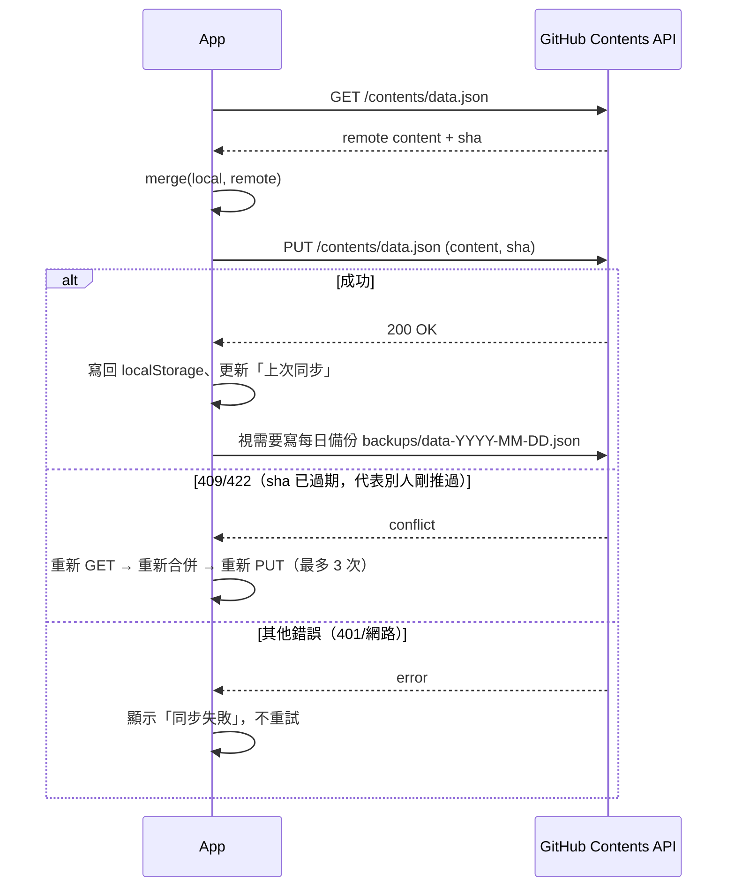

# 同步機制

實作見 [js/sync.js](../js/sync.js)。

## 流程：拉取 → 合併 → 推送 → 撞 SHA 重試

## 合併規則

- `events` / `growth`：以 `id` 聯集，同 `id` 取 `updatedAt` 較新的版本（見 data-model.md 為何要這樣）。
- `settings`：整包 last-write-wins，比較 `settings.updatedAt`。

## 觸發時機

1. **下拉刷新**：在首頁往下拉超過 64px 觸發，等同手動「立即同步」。
2. **App 切回前台**：`visibilitychange` 事件，且已設定 token/repo 時自動跑一次。
3. **設定頁「立即同步」按鈕**。

## 狀態回饋

首頁頂部的同步小提示列四種狀態：
- `idle`：「↓ 下拉同步」（可點擊手動觸發）
- `syncing`：旋轉圈圈「同步中…」
- `done`：「✓ 已同步」，2.2 秒後自動回到 idle
- `fail`：「⚠ 同步失敗・點擊重試」，常見原因是 token 失效或沒有網路，3.2 秒後回到 idle（但訊息消失不代表問題解決，使用者需要再次下拉或點擊重試）

## 為什麼不直接用「最後寫入贏」整份覆蓋？

`events`/`growth` 是多人各自新增的紀錄（爸爸手機、媽媽手機都在記），整份覆蓋會弄丟另一支手機新增的
紀錄。所以用「以 id 聯集」的合併策略，只有真的同一筆紀錄被两邊都編輯過時，才用 `updatedAt` 較新的
版本（理論上機率很低，因為通常只有原記錄者會去編輯/刪除自己那一筆）。
